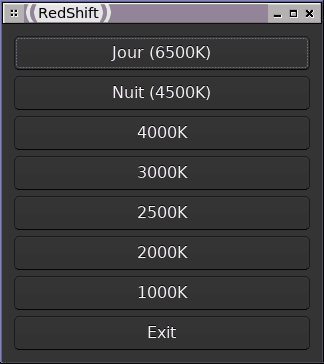

# nimredshift
A minimalist GUI for redshift on Raspberry py OS to change screen temperature, written in nim.\
It just a script written for my own usage, but someone might find it useful.\
It's much like [the one I wrote in python](https://github.com/aldoniel/pyredshift) except that the startup time is reduced because it's compiled, so you don't have to wait for the python interpreter to load.\
It works on my raspberry zero 2, but it should work on zero 1, 2 and 3.\
It won't work on raspberry 4 and 5 because gamma and brighness is not implemented in the driver (see [issue](https://github.com/raspberrypi/firmware/issues/1274))\
Also it's badly written because I have just read the two first nim tuto, but it works.

# Install
  * you need the redshift package from the repository, if it's not already installed.
  * download redshift-uing.nim
  * install nim. Easiest way (but not up to date) is from the repository `sudo apt install nim`
  * install uing (minimalist portable GUI toolkit) source `nimble install uing`
  * compile for example with `nim c -d:danger --opt:speed --app:gui`
  * copy the artifact where you want, make executable, create a shortcut and run.
  * if you trust me (but you shouldn't), you can also download a binary from github release on the right panel. Otherwise, you may check the python version which doesn't need this cumbersome compilation.
